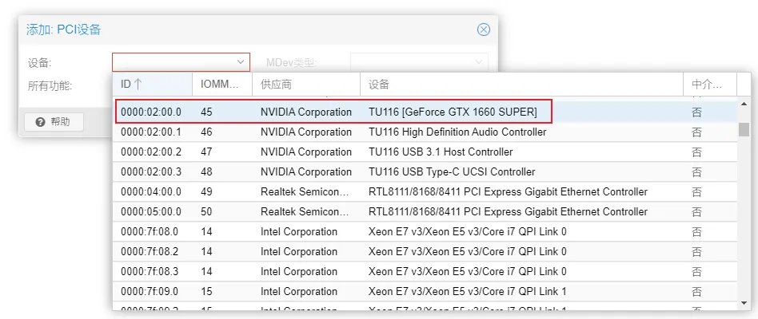
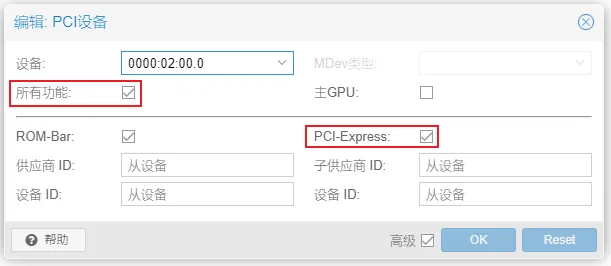
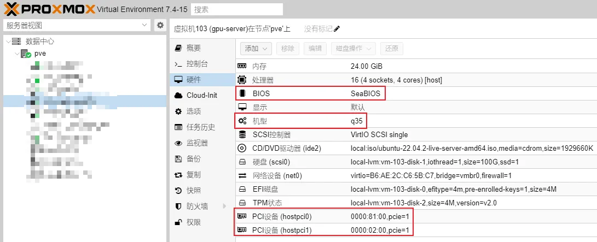

<!-- # Proxmox VE 配置 PCIe 显卡直通 -->

本文介绍了如何在 Proxmox VE 宿主机上配置 PCIe 显卡直通。

### 以下所有操作在 Proxmox VE 宿主机执行

## 收集必要信息

```bash
root@pve:~# lspci | grep VGA
02:00.0 VGA compatible controller: NVIDIA Corporation TU116 [GeForce GTX 1660 SUPER] (rev a1)
81:00.0 VGA compatible controller: NVIDIA Corporation TU116 [GeForce GTX 1660 SUPER] (rev a1)
^^^^^

```

记下开头`XX:XX` PCI 地址，如上方输出中的`02:00`和`81:00`。

```bash
root@pve:~# lspci -n -s 02:00
02:00.0 0300: 10de:21c4 (rev a1)
02:00.1 0403: 10de:1aeb (rev a1)
02:00.2 0c03: 10de:1aec (rev a1)
02:00.3 0c80: 10de:1aed (rev a1)
              ^^^^^^^^^
root@pve:~# lspci -n -s 81:00
81:00.0 0300: 10de:21c4 (rev a1)
81:00.1 0403: 10de:1aeb (rev a1)
81:00.2 0c03: 10de:1aec (rev a1)
81:00.3 0c80: 10de:1aed (rev a1)
              ^^^^^^^^^

```

记下`XXXX:XXXX` 形式的 Vendor ID 和 Device ID，有多个显卡的话都要记录但同款显卡通常相同（如上例）

## 修改系统配置

### 为显卡开启 vfio

编辑 `/etc/modprobe.d/vfio.conf`，写入以下内容，其中`^`标注部分替换成上方记录的 ID，用逗号分隔

```
options vfio-pci ids=10de:21c4,10de:1aeb,10de:1aec,10de:1aed disable_vga=1
#                    ^^^^^^^^^^^^^^^^^^^^^^^^^^^^^^^^^^^^^^^
# 只需要输入第一行

```

### 调整内核模块

编辑 `/etc/modprobe.d/blacklist.conf`，写入：

```
blacklist radeon
blacklist nouveau
blacklist nvidia

```

编辑 `/etc/modprobe.d/kvm.conf`，写入：

```
options kvm ignore_msrs=1

```

编辑 `/etc/modprobe.d/iommu_unsafe_interrupts.conf`，写入：

```
options vfio_iommu_type1 allow_unsafe_interrupts=1

```

修改 `/etc/modules`，写入：

```
vfio
vfio_iommu_type1
vfio_pci
vfio_virqfd

```

应用以上更改

```bash
update-initramfs -u -k all

```

### 修改 GRUB

编辑 `/etc/default/grub`，将 `CMDLINE_DEFAULT_GRUB`一行修改为：

```
GRUB_CMDLINE_LINUX_DEFAULT="quiet intel_iommu=on iommu=pt pcie_acs_override=downstream,multifunction nofb nomodeset video=efifb:off video=vesafb:off pcie_aspm=off initcall_blacklist=sysfb_init"

```

执行

```
sudo update-grub

```

### Tricky Workaround

编辑 `/root/fix_gpu_pass.sh` 写入：

```bash
#!/bin/bash
echo 1 > /sys/bus/pci/devices/0000\\:81\\:00.0/remove
echo 1 > /sys/bus/pci/devices/0000\\:02\\:00.0/remove
# 修改此处的 PCI 地址                ^^^^^^

echo 1 > /sys/bus/pci/rescan

```

并设置此脚本开机运行：

```bash
crontab -e

```

在打开的编辑器中修改文件，在文件末尾加入这一行：

```
@reboot /root/fix_gpu_pass.sh

```

## 重启 Proxmox VE 宿主机

## 验证修改生效

1. 运行此命令

```bash
dmesg | grep -e DMAR -e IOMMU

```

如果输出中包含形如以下内容，则 IOMMU 成功启用。

```
[    0.158925] DMAR: IOMMU enabled

```

1. 运行此命令

```bash
#!/bin/bash
shopt -s nullglob
for g in $(find /sys/kernel/iommu_groups/* -maxdepth 0 -type d | sort -V); do
    echo "IOMMU 组 ${g##*/}:"
    for d in $g/devices/*; do
        echo -e "\\t$(lspci -nns ${d##*/})"
    done;
done;

```

根据输出确认 GPU 处于单独的 IOMMU 分组，例如：

```
IOMMU 组 45:
        02:00.0 VGA compatible controller [0300]: NVIDIA Corporation TU116 [GeForce GTX 1660 SUPER] [10de:21c4] (rev a1)
IOMMU 组 46:
        02:00.1 Audio device [0403]: NVIDIA Corporation TU116 High Definition Audio Controller [10de:1aeb] (rev a1)
IOMMU 组 47:
        02:00.2 USB controller [0c03]: NVIDIA Corporation TU116 USB 3.1 Host Controller [10de:1aec] (rev a1)
IOMMU 组 48:
        02:00.3 Serial bus controller [0c80]: NVIDIA Corporation TU116 USB Type-C UCSI Controller [10de:1aed] (rev a1)

```

<!-- :::info{title="Hooray"}
至此，所有配置均已完成。下面开始配置虚拟机。
::: -->

## 配置虚拟机

> ⚠️ 以下内容仅适用于 Linux 虚拟机。Windows 虚拟机理论上可行，但我没有需求，故未曾尝试。
> FYI：参考资料中的 [3os.org](http://3os.org/) 有较为详细的相关教程。

按照正常流程新建 QEMU 虚拟机，但需要注意以下配置：

- BIOS 设置为 `SeaBIOS`（默认）
- 机型 设置为 `q35`
- 创建完成后不要开机，先到`硬件 - 添加 - PCI设备` 添加显卡
  - “设备”选择带显卡名称的项目
  - 勾选 `所有功能` 和 `PCI-Express`







## 完成

接下来你可以启动虚拟机，安装系统和显卡驱动，然后开始使用。

### 参考资料

- [GPU Passthrough to VM - 3os](https://3os.org/infrastructure/proxmox/gpu-passthrough/gpu-passthrough-to-vm/)
- [PCI Passthrough - Proxmox VE](https://pve.proxmox.com/wiki/PCI_Passthrough)
- [How to Set Up GPU Passthrough on Proxmox (2023) - WunderTech](https://www.wundertech.net/how-to-set-up-gpu-passthrough-on-proxmox/)
